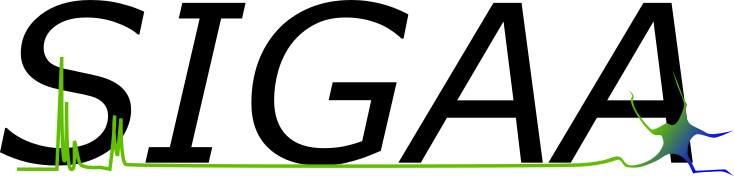

# SIGAA - SIGnaling Automated Analysis 

MATLAB script that performs an automatic stabilization of the recorded Ca2+ imaging videos with a template matching algorithm followed by astrocyte identification using ROIs through morphological reconstruction techniques. SIGAA generates intracellular Ca2+ evolution functions for all the identified ROIs, detects the Ca2+ transients, the Ca2+ transients amplitude, as well as a set of features calculated for each signal, such as slope, duration, rise and decay.

## User guide

## Test cases
